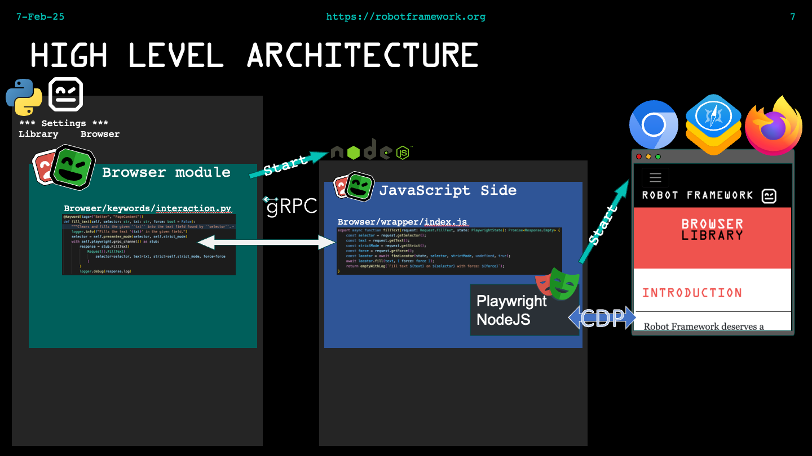

[<- Back](/README.md)

# 1.1 Architecture

Robot Framework Browser library is a Python library, which uses Playwright NodeJS and connects to it via gRPC protocol.

# 1.1.1 Interpreter environment management
Use [pyenv](https://github.com/pyenv/pyenv) Python version management and Python
[venv](https://docs.python.org/3/library/venv.html) for project specific dependencies management.

Also it is recommended to use versioning for NodeJS, see [n](https://github.com/tj/n) or
[nvm](https://github.com/nvm-sh/nvm) for Linux and Mac. For Windows see
[nodist](https://github.com/nullivex/nodist)
or [nvm-windows](https://github.com/coreybutler/nvm-windows).

Why pyenv: lets you easily switch between multiple versions of Python.

Why venv: venv module supports creating lightweight “virtual environments”, each with their own
independent set of Python packages installed in their site directories.

# 1.1.2 Installation and binary structure

`pip install robotframework-browser` installs all Python
[dependencies](https://github.com/MarketSquare/robotframework-browser/blob/main/Browser/requirements.txt)
, precompiled [grpc](https://grpc.io/) protocol and precompiled JavaScript code. Installation is done under
the Python environment, example in: `.venv/lib/python3.9/site-packages/Browser/`, but this is just an
example in my environment.

## 1.1.2.1 rfbowser init
By default `rfbrowser init` installs all NodeJS
[dependencies](https://github.com/MarketSquare/robotframework-browser/blob/main/package.json)
, installation is done by default to `site-packages/Browser/wrapper/node_modules/` directory.
This also install browser binaries under the `node_modules` folder, which easily can be
+700Mb for each Browser library installation.

If you do no need all browser binaries installed, it is
possible to install only selected browser binaries. Example `rfbrowser init chromium` will install chromium
binaries, but not wekit and firefox.

## 1.1.2.2 Where is log from installation
By default all installation is logged in console and in a `site-packages/Browser/rfbrowser.log` file.
Please remember last ten `rfbrowser` command are saved by
rotating the log file. After ten command log files are
overwritten.

## 1.1.2.3 Hwo to manage browser binaries in CI
Use `rfbrowser init --skip-browsers`, will install all NodeJS dependencies, expect the Playwright browser binaries. Playwright documentation, [managing browser binaries](https://playwright.dev/docs/browsers#managing-browser-binaries)
provides instructions how to install Browser binaries in custom location, example in Bash with command:
`PLAYWRIGHT_BROWSERS_PATH=$HOME/pw-browsers npx playwright install`

Before running Robot Framework test, set the `$PLAYWRIGHT_BROWSERS_PATH` environment variable value
to the path where browser binaries are installed. Environment variable needs to be set before running `robot`
command, example in Bash `PLAYWRIGHT_BROWSERS_PATH=$HOME/pw-browsers`.

Installing browser binaries only one time and in
external location shortens the installation with
considerably. Also, example CI environment can contains
multiple installation of Browser library, it will save
disk space.
