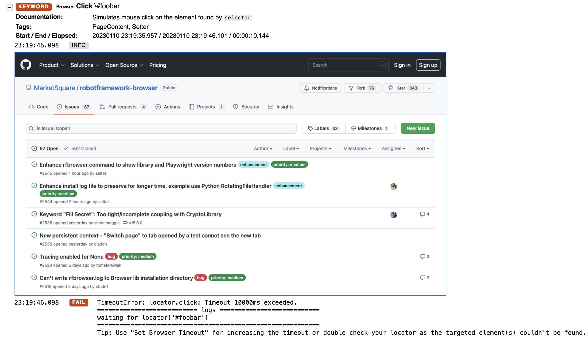
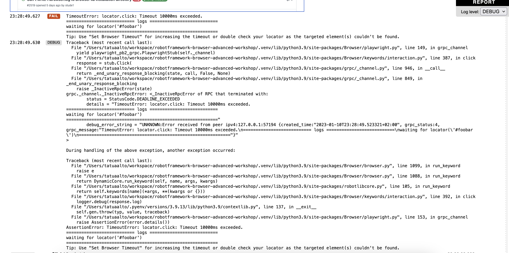
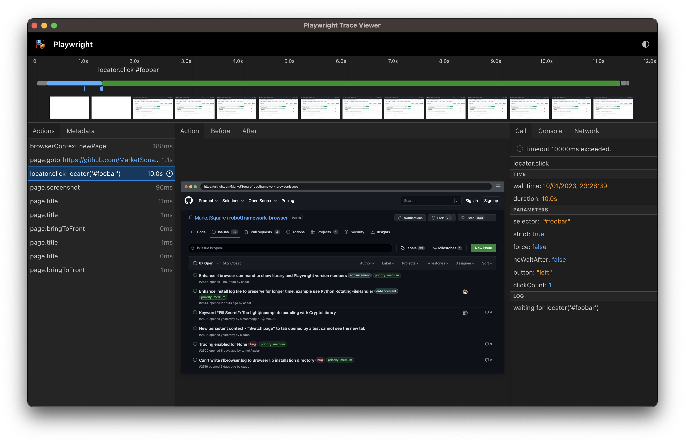

[<- Back](/README.md)

# 1.3 Logging (playwright Logs, Robot Loglevel, PW Trace)

## 1.3.1 log.html
Robot Framework `log.html` file contains mostly logging from Python side of the library. Also some keywords may
log limited amount of events from the NodeJS side. If Browser library keyword fails, in info level logging
will show the error in the Playwright API call. 

When running this example:
```robotframework
*** Setting ***
Library    Browser

*** Test Cases ***
Playwrifght debug logs
    New Page    https://github.com/MarketSquare/robotframework-browser/issues
    Click    \#foobar
```
with command:
```bash
robot --outputdir output 1.3.Logging/example_logging_on_error.robot
```


But when using debug level:
```bash
robot --loglevel debug --outputdir output 1.3.Logging/example_pw_trace.robot
```


contains more detailled error message from the NodeJs side.

## 1.3.2 Playwright logs
`${OUTPUT_DIR}/playwright-log.txt` is always created, by default it contains only logging from NodeJS side from 
Browser library. Setting loglevel in the Robot Framework side does not affect logging created in the
`playwright-log.txt` file. More details can gathered by enabling Playwright logging, this is done in library import,
with  setting: `enable_playwright_debug=True`. Please note that enabling Playwright logging will log everything
as plain text, including secrets.

Execute example when Playwright logging is not enabled:
```robotframework
*** Setting ***
Library    Browser

*** Test Cases ***
Playwrifght debug logs
    New Page    https://github.com/MarketSquare/robotframework-browser/issues
    Click    \#code-tab
    Wait Until Network Is Idle    timeout=3s
    Type Text    input[name="q"]    robotframework
    Keyboard Key    press    Enter
    Take Screenshot

```
with command:
```bash
robot --outputdir output 1.3.Logging/example_pw_logging_disabled.robot
```
and look the `playwright-log.txt` from the output directory.

Execute example when Playwright logging is enabled:
```robotframework
*** Setting ***
Library    Browser    enable_playwright_debug=True

*** Test Cases ***
Playwrifght debug logs
    New Page    https://github.com/MarketSquare/robotframework-browser/issues
    Click    \#code-tab
    Wait Until Network Is Idle    timeout=3s
    Type Text    input[name="q"]    robotframework
    Keyboard Key    press    Enter
    Take Screenshot

```
with command:
```bash
robot --outputdir output 1.3.Logging/example_pw_logging_enabled.robot
```
and look again the `playwright-log.txt` from the output directory.

## 1.3.3 Playwright trace

Playwright provides [trace](https://playwright.dev/docs/trace-viewer-intro) possibility. Tracing can be enabled
with `New Context    tracing=filename.zip` keyword. When
[pages](https://marketsquare.github.io/robotframework-browser/Browser.html#New%20Page) are opened under the same
context, then each Playwright API call in the page is recorded to the trace file. 

When this is an example:
```robotframework
*** Setting ***
Library    Browser

*** Test Cases ***
Playwrifght debug logs
    New Context    tracing=trace.zip
    New Page    https://github.com/MarketSquare/robotframework-browser/issues
    Click    \#foobar
    Click    \#code-tab
    Wait Until Network Is Idle    timeout=3s
    Type Text    input[name="q"]    robotframework
    Keyboard Key    press    Enter
    Take Screenshot

```

Is run with command:
```bash
robot --outputdir output 1.3.Logging/example_pw_trace.robot
```

Then `trace.zip` file from the output directory can be opened in two ways. 
1) Playwright provides online service: https://trace.playwright.dev/
2) Open trace file locally with command:
````bash
fbrowser show-trace --file output/trace.zip
````

Then user should see something like: 

