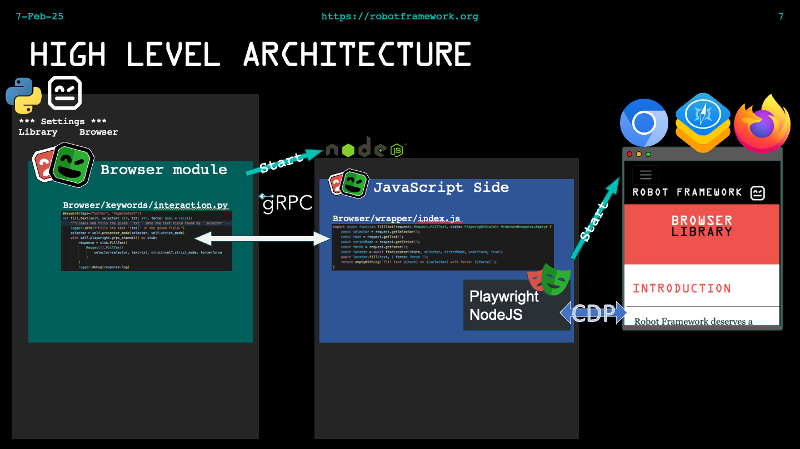

# 1.1 Architecture

Robot Framework Browser library is a Python library, which uses Playwright NodeJS and connects to it via gRPC protocol.




## 1.1.1 Interpreter environment management
Currently there are several good ways to manage your Python environment,
example: [uv](https://docs.astral.sh/uv/), [pyenv](https://github.com/pyenv/pyenv)
or [venv](https://docs.python.org/3/library/venv.html). Also there are many others
ways to manage your Python environment and all have their pros and cons. Also if
you are using Python in company controlled network, it might bring it's own
set ot rules and limitations. Because there are so many good ways to manage your
environment, it is hard to give single set of recommendations which would fit all.

Also it is recommended to use versioning for NodeJS, see [n](https://github.com/tj/n) or
[nvm](https://github.com/nvm-sh/nvm) for Linux and Mac. For Windows see
[nodist](https://github.com/nullivex/nodist)
or [nvm-windows](https://github.com/coreybutler/nvm-windows).

The main point of all the tooling is: **Never install dependencies to system Python**
Almost in all cases, you need to test with multiple versions of Python. Even in cases
when you one repository to do all your test automation. You should be regularly updating
your Python to latest patched version and at least once a year, your should update your
Python major version.

Why use Python virtual environment (venv): venv supports creating lightweight
“virtual environments”, each with their own independent set of Python packages installed
in their site directories. Using venv is handy when there multiple projects using
different Python dependencies.

## 1.1.2 Installation strategies
There are two different ways to install Browser library:
1) Without NodeJS
2) With NodeJS

The former is the recommended way, because it is (most likely) an simpler way, because
users do not have install NodeJS. In this installation method, it is possible
to install the NodeJS dependencies as a precompiled Python wheel package called
[BrowserBatteries](https://pypi.org/project/robotframework-browser-batteries/),
example with pip or some other python package manager. BrowserBatteries contains
NodeJS binary, all the NodeJS dependencies and entry point the start the internal
GRPC server compiled as a single executable.

The down side of this installation is that Browser project does not provide the
BrowserBatteries package for every possible OS and CPU architecture, specially the
some Linux distribution might use version of [gcc](https://www.gnu.org/software/gcc/)
which we do not support.

The other down side is that BrowserBatteries contains only dependencies which are
needed to run Browser library. Users might have dependencies which are not included
and therefore user might want to use installation with NodeJS.

The other option is to install with NodeJS. The advantage of this method is that,
users can install extra NodeJS dependencies and choose the OS more freely
(BrowserBatteries is provided with only a handful of OS and CPU combinations)
because if OS supports Python and NodeJS, it is very likely that it is possible
to run Browser library in it.

## 1.1.3 Binary structure
Regardless of the installation way, without or with NodeJS, the installation is always
done in the Python environment, example in: `.venv/lib/python3.14/site-packages/Browser/`,
but this is just an example in my environment. The NodeJS dependencies (regardless of the
installation way) are by default put in `Browser/wrapper` directory. The Playwright
browser binaries installation location, like Chrome for testing can be managed with
`PLAYWRIGHT_BROWSERS_PATH` environment variable. See more details in Playwright
documentation: https://playwright.dev/docs/browsers#managing-browser-binaries


## 1.1.4 Install
As discussed above there are two ways to install Browser library, with or without BodeJS.
Both ways have their own pros and cons and it depends on users needs what way should be takes.
But it is recommended to first go with BrowserBatteries installation method first. If user
have some special needs, like from the OS, after that go with the installation that ues NodeJS.

### 1.1.4.1 Install without NodeJS
Install the BrowserBatteries Python package first:
```shell
> pip install robotframework-browser-batteries
```
This will install all the Python dependencies, including the Browser library and the precompiled
GRPC server.

If user does not have Chromium based browser installed, or there is need to use `Firefox` or `WebKit`
browser binaries, then user needs to install Playwright browser binaries:
```shell
> rfbrowser install
```
This will download only the Playwright browser binaries.

The `rfbrowser install` is not mandatory. Example if user wants to only  use chromium based browser,
like Edge in testing and Edge is already installed, user can skip the `rfbrowser install` command.
If you do no need all browser binaries installed, it is possible to install only selected browser
binaries. Example `rfbrowser install firefox` will install firefox binaries, but not wekit and
chromium.

### 1.1.4.2 Install with NodeJS
Install the Browser library Python package first:
```shell
> pip install robotframework-browser
```
This will install all required the Python dependencies. Then install NodeJS dependencies with
```shell
> rfbrowser init
```
The `rfbrowser init` is mandatory, because Browser library does not work without installing
the NodeJS dependencies. If you do no need all browser binaries installed, it is
possible to install only selected browser binaries. Example `rfbrowser init chromium` will install chromium
binaries, but not wekit and firefox.

### 1.1.4.3 Where is log from installation
By default all installation is logged in console and in a `site-packages/Browser/rfbrowser.log` file.
Please remember last ten `rfbrowser` command are saved by
rotating the log file. After ten command log files are
overwritten.

### 1.1.4.4 Hwo to manage browser binaries in CI
Use `rfbrowser init --skip-browsers`, will install all NodeJS dependencies, expect the Playwright browser
binaries. Playwright documentation,
[managing browser binaries](https://playwright.dev/docs/browsers#managing-browser-binaries)
provides instructions how to install Browser binaries in custom location, example in Bash with command:
`PLAYWRIGHT_BROWSERS_PATH=$HOME/pw-browsers npx playwright install`

Before running Robot Framework test, set the `$PLAYWRIGHT_BROWSERS_PATH` environment variable value
to the path where browser binaries are installed. Environment variable needs to be set before running `robot`
command, example in Bash `PLAYWRIGHT_BROWSERS_PATH=$HOME/pw-browsers`.

Installing browser binaries only one time and in external location shortens the installation with
considerably. Also, example CI environment can contains multiple installation of Browser library, it
will save disk space.
